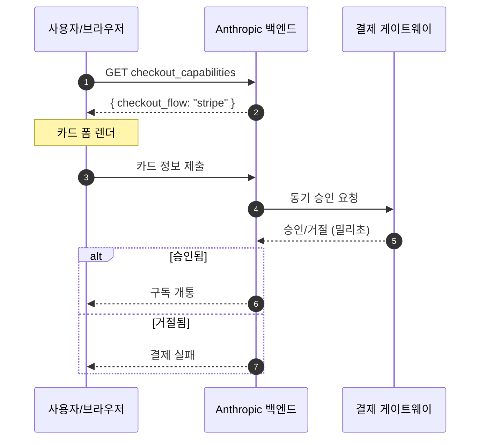
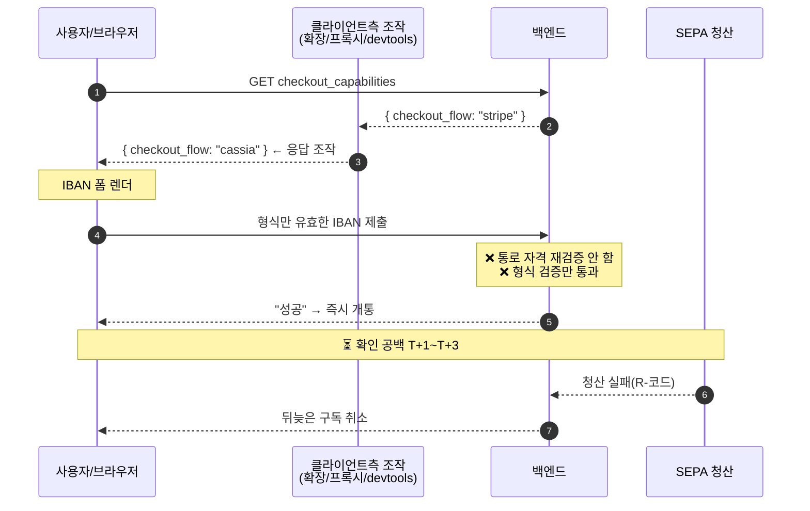
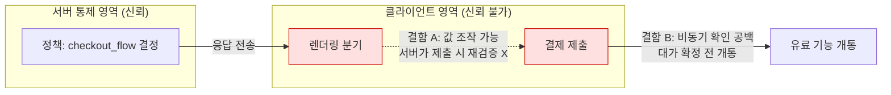

# 다이어그램

GitHub는 Mermaid를 렌더링한다. 아래 세 다이어그램은 (1) 정상 플로우, (2) 취약 플로우, (3) 신뢰경계와 확인 공백을 보여준다.

## 1. 정상 결제 플로우 (서버가 통로를 강제)

## 2. 취약 플로우 (클라이언트가 통로를 덮어씀)

## 3. 신뢰경계와 두 결함의 곱셈

> 결함 A(신뢰경계 붕괴)와 결함 B(확인 공백)는 각각 단독으로는 치명적이지 않지만, 곱해지면 "형식만 맞는 계좌 → 즉시 개통"의 완결된 사슬이 된다.
